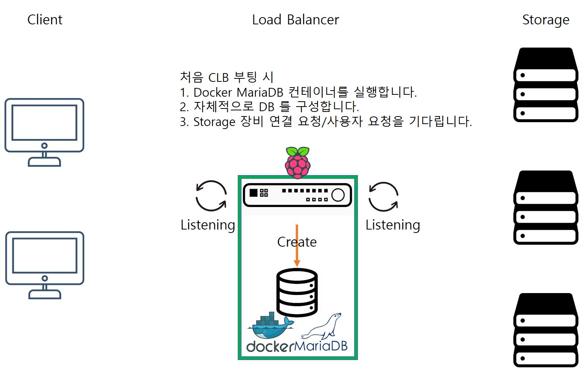
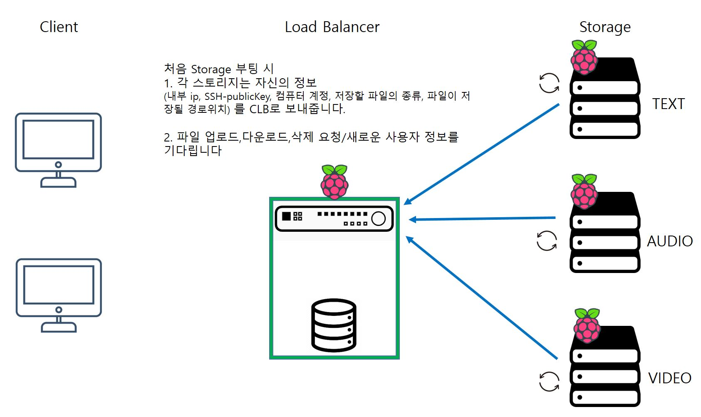
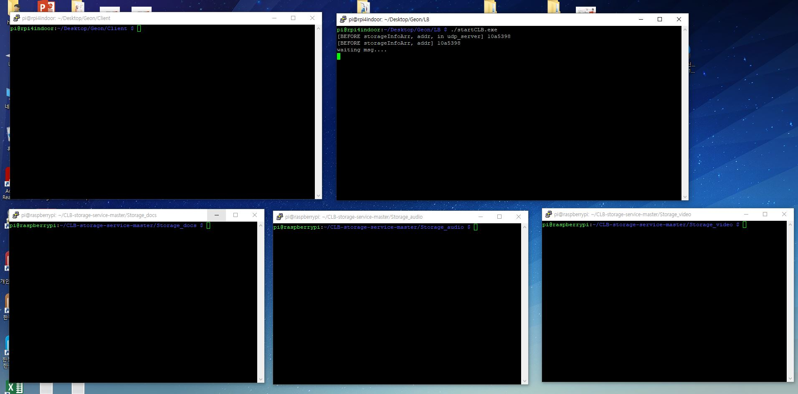
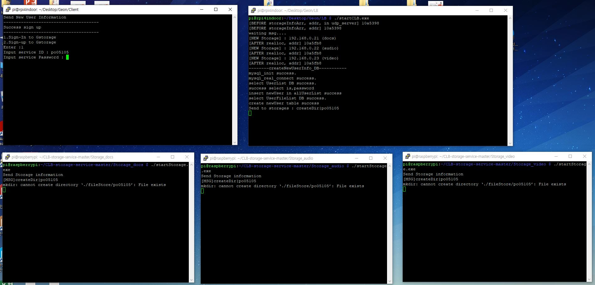
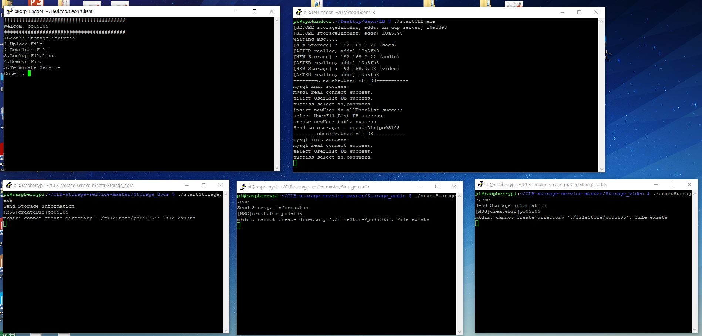

# CLB(Content LoadBalance)+StorageService
### 2021 Hallym Universty System Programming

#### Team Member : 박건형
#### Project Period : 2021/11/13 ~ 2021/11/30
----

# 1. Project Overview
>__Google Drive, DropBox, NAS 와 같이 사용자 계정에 따라 분리하여 원격지의 머신에 파일을 저장하고 파일의 종류(컨텐츠) 에 따라서 로드 발란싱하여 맞는 스토리지에 저장합니다.__

**1. 구현 서비스**
- 로그인
- 계정 만들기
- 파일 업로드
- 파일 다운로드
- 파일 삭제
- 파일리스트 조회

**2. 개발 활용**
- Linux
- C Lang
- Shell Script
- scp (Secure Copy)
- Docker
- MariaDB & API
- RasBerry Pi

**3. 서비스 구조** 
>__CLB 와 Storage는 같은 네트워크를 사용하고 Client는 외부의 네트워크에서 접속 한다고 가정합니다.__


# 2. Project Diagram

## _2-1. Configure System Diagram_
>__초기 시스템 구성/새로운 장비 설치시 대한 다이어그램입니다__

**1. 초기 CLB 부팅**

<details>
<summary>시스템을 구성하기위해 처음 CLB 부팅 시 동작입니다.</summary>
<div>

>

</div>
</details>

**2. Storage 부팅(새로운 장비)**
<details>
<summary>스토리지 장비로 사용될 장비가 부팅 시 동작입니다.</summary>
<div>

>
</div>
</details>

---

## _2-2. Service Diagram_
>__서비스 마다 동작 요청/응답 메세지와 동작 시퀀스에 대한 다이어그램입니다.__

**1. 로그인(Sign In)**

<details>
<summary>이미 서비스에 가입된 사용자에 대한 로그인 동작입니다.</summary>
<div>

>
</div>
</details>

**2. 계정 만들기(Sign Up)**

<details>
<summary>서비스에 새로 가입하는 사용자에 대한 동작입니다.</summary>
<div>

>
</div>
</details>

**3. 파일 업로드(File Upload)**
<details>
<summary>사용자가 스토리지로 파일 업로드 요청 시 동작입니다.</summary>
<div>

>
</div>
</details>

**4. 파일 다운로드(File Download)**
<details>
<summary>사용자가 스토리지로 부터 파일 다운로드 요청 시 동작입니다.</summary>
<div>

>
</div>
</details>

**5. 파일 삭제(File Remove)**
<details>
<summary>스토리지에 업로드(저장)된 파일을 삭제 요청 시 동작입니다.</summary>
<div>

>
</div>
</details>

**6. 파일리스트 조회(Lookup File list)**
<details>
<summary>사용자가 업로드한 파일의 리스트 요청 시 동작입니다.</summary>
<div>

>
</div>
</details>

# 3. Project Running Screen
>__프로젝트 구동 화면 입니다__
 - 화면 구성


---

## _2-1. Configure System screen_

**1. CLB부팅**
<details>
<summary>CLB 부팅 직후 화면입니다.</summary>
<div>

>
</div>
</details>

**2. Storage 부팅**
<details>
<summary>종류별 Storage 부팅 직후 화면입니다.</summary>
<div>

>
</div>
</details>

---

## _2-2. Service screen_

**1. Client 실행**
<details>
<summary>사용자 프로그램 시작 직후 화면입니다.</summary>
<div>

>
</div>
</details>

**2. 계정 만들기(Sign Up)**
<details>
<summary>서비스 가입시 화면입니다.</summary>
<div>

>
>
</div>
</details>

**3. 로그인(Sign In)**
<details>
<summary>로그인시 화면입니다.</summary>
<div>

>
>
</div>
</details>

**4. 파일 업로드(File Upload)**
<details>
<summary>파일 업로드시 화면입니다.</summary>
<div>

>
>

업로드 이후 파일리스트 화면입니다.
>
</div>
</details>

**5. 파일 다운로드(File Download)**
<details>
<summary>파일 다운로드시 화면입니다.</summary>
<div>

>

downloadFile 디렉토리에 파일이 다운로드 되었습니다.
>
</div>
</details>

**6. 파일 삭제(File Remove)**
<details>
<summary>파일 삭제시 화면입니다.</summary>
<div>

먼저 파일하나를 더 업로드 합니다.
>
>

삭제를 요청 합니다.
>
>
</div>
</details>

**7. 서비스 종료**
<details>
<summary>서비스 종료시 화면입니다.</summary>
<div>

>

_추가_
여러 유저가 접속 하여 사용이 가능합니다.
>
</div>
</details>

# 4. Project 활용방안과 필요성
> 1. 일반적인 사용자도 서버용 하드웨어를 가지고만 있다면 프로젝트를 다운받아 사용이 가능합니다.
> 2. 작은 on-Premise 환경을 가진 회사도 사용이 가능합니다. 직원들은 편리하게 어디서든 파일에 접근하고, 회사 입장에서도 파일을 통합 관리 할 수 있습니다.

# 5. How to use Project
>- 먼저 [사전 작업](###-Setting-<사전-작업>)을 수행한 뒤 아래 내용을 수행하세요.
>- 총 4대의 머신(라즈베리파이,컴퓨터)을 준비 합니다.
>- CLB로 사용할 머신에 `LB` 폴더를 다운 받습니다.
>- Storage로 사용할 머신들에 각각 `Storage_docs`, `Storage_video`,`Storage_audio` 폴더를 다운 받습니다.
>   - `Storage_` 뒤에 붙은 것은 저장할 파일의 종류이고, 만약 저장할 파일의 종류를 바꾸고 싶다면 [여기](#How-to-change-Storage-kind-<스토리지-저장-파일-종류-바꾸기>)를 클릭하세요.
>- 파일 사용자는 `Client` 폴더를 다운 받습니다.
>- CLB IP를 파악 한 다음. 
>   - `Clinet/clientMoniter.d/currentStorageInfo.h` 파일의 16번 라인
>   - `LB/main.h` 파일의 16번 라인
>   - `Storage_<파일 종류>/storageMyInfo.h` 파일의 2번 라인
>   - 을 아래와 같이 수정 하세요
>```c
>#define LB_IP "<CLB IP>" //수정
>#define LB_IP "192.168.0.20" //예시
>```
>- 이후 모든 머신에서 `make` 명령어 수행 (컴파일이 수행 됩니다. 혹시 잘 안된다면 `make clean` 명령어 입력후 다시 `make`를 시도하세요.)
>- CLB머신에서 `LB/startCLB.exe` 실행
>- Storage 각 머신에서 `Storage_<파일 종류>/startStorage.exe` 실행
>- 사용자는 `Client/` 에서 `sh ./Geon_StorageService.sh` 명령어 실행하여 서비스를 이용합니다!

---

### Setting <사전 작업>
> - CLB로 사용할 머신 사전 작업
>   - `sudo apt update`
>   - `sudo apt install docker.io`
>   - 라즈베리파이인 경우
>       - `sudo docker run --name mariadb_clb -p 3306:3306 -e MYSQL_ROOT_PASSWORD =user -e TZ=Asia/Seoul -d jsurf/rpi-mariadb`
>   - 일반 머신인 경우
>       - `sudo docker run --name mariadb_clb -p 3306:3306 -e MYSQL_ROOT_PASSWORD =user -e TZ=Asia/Seoul -d mariadb`
>   - `/etc/systemd/system/`경로에 `LB/mariadb_clb.service` 파일 복사/넣기
>   - `sudo systemctl enable mairadb_clb`
>   - `sudo systemctl start mairadb_clb` 
>       - 머신이 꺼지더라도 `mariadb_clb` 컨테이너는 자동으로 다시 실행 됩니다.

> - CLB로 사용할 머신 DB Setting
>   - `sudo docker exec -it mariadb_clb bash` 컨테이너로 접속
>   - `mysql -u root -p` 비밀번호 `user` 입력
>``` sql
>   [none]> CREATE DATABASE UserFileList;
>   [none]> CREATE DATABASE UserList;
>   [none]> CREATE DATABASE getLocation;
>```
>``` sql 
>   [none]> USE UserList;
>   [UserList]> CREATE TABLE allUserList (
>               id          VARCHAR(100) NOT NULL PRIMARY KEY,
>               password    VARCHAR(100) NOT NULL,
>               join_date   DATETIME     DEFAULT  now()
>           );
>   [UserList]> USE getLocation;
>   [getLocation]> CREATE TABLE extSet (
>                   ext      VARCHAR(100) NOT NULL PRIMARY KEY,
>                   location VARCHAR(100) NOT NULL
>               );
>```
>
>아래 와 같이 아이템을 삽입 합니다
>```sql
> INSERT INTO extSet (ext,location) VALUES (... ,...); #예시
>+------+----------+
>| ext  | location |
>+------+----------+
>| avi  | video    |
>| doc  | docs     |
>| docx | docs     |
>| flv  | video    |
>| html | docs     |
>| hwp  | docs     |
>| mkv  | video    |
>| mov  | video    |
>| mp3  | audio    |
>| mp4  | video    |
>| ogg  | audio    |
>| pdf  | docs     |
>| raw  | audio    |
>| txt  | docs     |
>| wav  | audio    |
>| wma  | audio    |
>| wmv  | video    |
>+------+----------+
>```
>만약 Storage 가 받는 파일의 종류를 바꾸셨다면<br>
>location에 해당 Storage의 종류를 입력하고, ext에 넣고싶은 확장자를 입력하면 됩니다.


>- Client 사용자 사전 준비
>   - `sudo apt update`
>   - `sudo apt install sshd`
>   - `sudo apt install sshpass`


### How to change Storage kind <스토리지 저장 파일 종류 바꾸기>