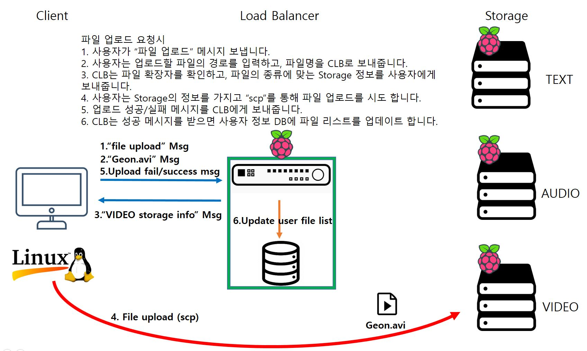

# CLB(Content LoadBalance)+StorageService
### 2021 Hallym Universty System Programming

#### Team Member : 박건형
#### Project Period : 2021/11/13 ~ 2021/11/30
----

# 1. Project Overview
>__Google Drive, DropBox, NAS 와 같이 사용자 계정에 따라 분리하여 원격지의 머신에 파일을 저장하고 파일의 종류(컨텐츠) 에 따라서 로드 발란싱하여 맞는 스토리지에 저장합니다.__

**1. 구현 서비스**
- 로그인
- 계정 만들기
- 파일 업로드
- 파일 다운로드
- 파일 삭제
- 파일리스트 조회

**2. 개발 활용**
- Linux
- C Lang
- Shell Script
- scp (Secure Copy)
- Docker
- MariaDB & API
- RasBerry Pi

**3. 서비스 구조** 
>CLB 와 Storage는 같은 네트워크를 사용하고 Client는 외부의 네트워크에서 접속 한다고 가정합니다.

# 2. Project Diagram

## _2-1. Configure System Diagram_
>__초기 시스템 구성/새로운 장비 설치시 대한 다이어그램입니다__

**1. 초기 CLB 부팅**
- 시스템을 구성하기위해 처음 CLB 부팅 시 동작입니다.

**2. Storage 부팅(새로운 장비)**
- 스토리지 장비로 사용될 장비가 부팅 시 동작입니다.

---

## _2-2. Service Diagram_
>__ 서비스 마다 동작 요청/응답 메세지와 동작 시퀀스에 대한 다이어그램입니다.__

**1. 로그인(Sign In)**
- 이미 서비스에 가입된 사용자에 대한 로그인 동작입니다.

**2. 계정 만들기(Sign Up)**
- 서비스에 새로 가입하는 사용자에 대한 동작입니다.

**3. 파일 업로드(File Upload)**
- 사용자가 스토리지로 파일 업로드 요청 시 동작입니다.

**4. 파일 다운로드(File Download)**
- 사용자가 스토리지로 부터 파일 다운로드 요청 시 동작입니다.
- 

**5. 파일 삭제(File Remove)**
- 스토리지에 업로드(저장)된 파일을 삭제 요청 시 동작입니다.
- 

**6. 파일리스트 조회(Lookup File list)**
- 사용자가 업로드한 파일의 리스트 요청 시 동작입니다.
- 

